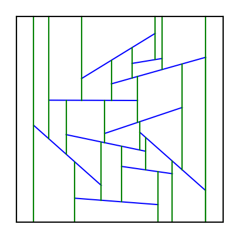

# Planar-Point-Location
The problem of planar partitioning and planar point location is a fundamentall challange in computational geometry. This project provides efficient structure for answearing point location queries in such plane.  

## Authors

[Kacper Kopiec](https://github.com/KacperKopiec)  
[Aleksandra Zwonek](https://github.com/ozwonek)

## Overview

A trapezoidal map preprocesses a partitioning of the plane (represented by individual line segments) by decomposing regions into simpler trapezoidal cells.

  
In parallel to constructing the map, we build a search structure in the form of a directed acyclic graph, enabling efficient point location queries. This structure allows the trapezoid containing a given query point to be found in O(log n) expected time.

## Documentation and presentation (only in Polish)
[Documentation](./dokumentacja.pdf)  
[Presentation](./prezentacja.pdf)